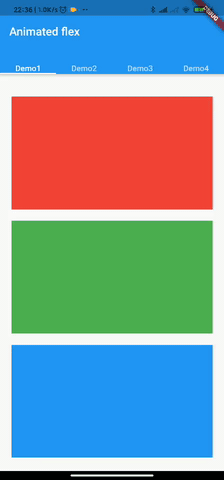

# Animated flex

Flutter animation flex.

## example



### demo1
```
AnimatedFlex(
  children: [
    Container(
      color: Colors.red,
      height: 200,
      margin: EdgeInsets.only(top: 20),
    ),
    Container(
      color: Colors.green,
      height: 200,
      margin: EdgeInsets.only(top: 20),
    ),
    Container(
      color: Colors.blue,
      height: 200,
      margin: EdgeInsets.only(top: 20),
    ),
  ],
)
```
### demo2
```
AnimatedFlex(
  animationWidgetBuilder: (Animation animation, Widget child) {
    return Opacity(
      opacity: animation.value,
      child: Transform(
        transform: Matrix4.translationValues(
            20 * (1.0 - animation.value),
            20 * (1.0 - animation.value),
            0.0),
        child: child,
      ),
    );
  },
  children: [
    Container(
      color: Colors.red,
      height: 200,
      margin: EdgeInsets.only(top: 20),
    ),
    Container(
      color: Colors.green,
      height: 200,
      margin: EdgeInsets.only(top: 20),
    ),
    Container(
      color: Colors.blue,
      height: 200,
      margin: EdgeInsets.only(top: 20),
    ),
  ],
)
```
### demo3
```
Column(
  children: [
    SizedBox(
      height: 100,
      child: AnimatedFlex(
        animationWidgetBuilder: (Animation animation, Widget child) {
          return Opacity(
            opacity: animation.value,
            child: Transform(
              transform: Matrix4.translationValues(
                  20 * (1.0 - animation.value), 0, 0.0),
              child: child,
            ),
          );
        },
        mainAxisAlignment: MainAxisAlignment.spaceBetween,
        direction: Axis.horizontal,
        children: [
          Container(
            color: Colors.red,
            height: 100,
            width: 100,
          ),
          Container(
            color: Colors.green,
            height: 100,
            width: 100,
          ),
          Container(
            color: Colors.blue,
            height: 100,
            width: 100,
          ),
        ],
      ),
    ),
    SizedBox(
      height: 400,
      child: AnimatedFlex(
        delayed: Duration(milliseconds: 1000),
        animationWidgetBuilder: (Animation animation, Widget child) {
          return Opacity(
            opacity: animation.value,
            child: Transform(
              transform: Matrix4.translationValues(
                  20 * (1.0 - animation.value),
                  20 * (1.0 - animation.value),
                  0.0),
              child: child,
            ),
          );
        },
        children: [
          Container(
            color: Colors.red,
            height: 100,
            margin: EdgeInsets.only(top: 20),
          ),
          Container(
            color: Colors.green,
            height: 100,
            margin: EdgeInsets.only(top: 20),
          ),
          Expanded(
            child: Container(
              color: Colors.blue,
              // height: 100,
              margin: EdgeInsets.only(top: 20),
            ),
          ),
        ],
      ),
    ),
  ],
)
```
### demo4
```
AnimatedFlex(
  animationWidgetBuilder: (Animation animation, Widget child) {
    return Opacity(
      opacity: animation.value,
      child: Transform.scale(
          scale: 0.8 + animation.value * .2,
          child: child),
    );
  },
  children: [
    Container(
      color: Colors.red,
      height: 150,
      margin: EdgeInsets.only(top: 20),
    ),
    Container(
      color: Colors.green,
      height: 150,
      margin: EdgeInsets.only(top: 20),
    ),
    Container(
      color: Colors.blue,
      height: 150,
      margin: EdgeInsets.only(top: 20),
    ),
  ],
)
```